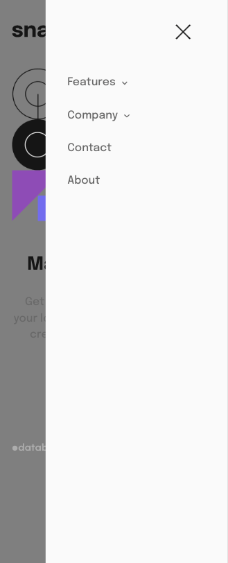
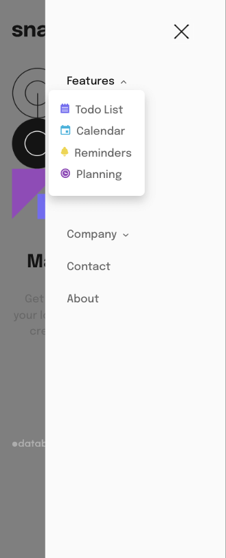
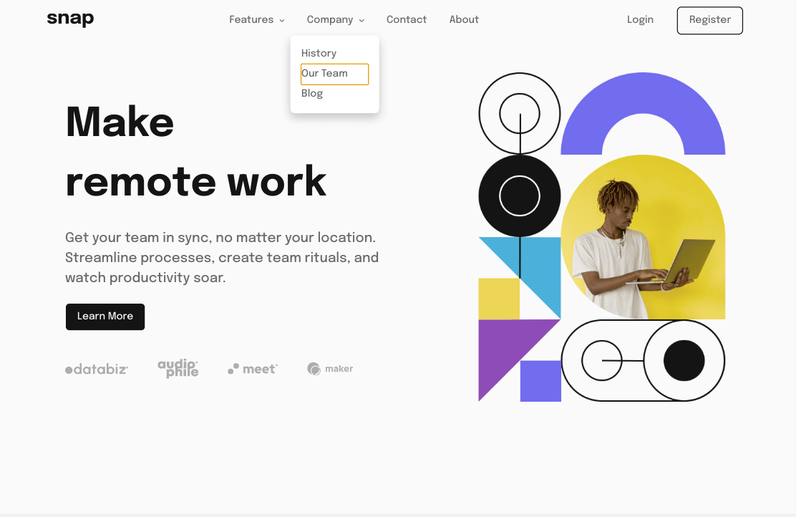

# Frontend Mentor - Intro section with dropdown navigation solution

This is a solution to the [Intro section with dropdown navigation challenge on Frontend Mentor](https://www.frontendmentor.io/challenges/intro-section-with-dropdown-navigation-ryaPetHE5). Frontend Mentor challenges help you improve your coding skills by building realistic projects. 

## Table of contents

- [Overview](#overview)
  - [The challenge](#the-challenge)
  - [Screenshot](#screenshot)
- [My process](#my-process)
  - [Built with](#built-with)
  - [Continued development](#continued-development)
  - [Useful resources](#useful-resources)

## Overview

### The challenge

Users should be able to:

- View the relevant dropdown menus on desktop and mobile when interacting with the navigation links
- View the optimal layout for the content depending on their device's screen size
- See hover states for all interactive elements on the page

### Screenshot

## My process

### Built with

- Semantic HTML5 markup
- CSS custom properties
- Flexbox
- CSS Grid
- Accessibility

### Continued development

- No Login / Register on mobile expanded menu seems like an oversight. 
- The way I refactored the nav may prevents me from including the buttons on the sidepanel anyway.
- I could add a wrapper div to maybe add them.    
- The Hero's height causes layout problems.  I used padding to control it versus setting a width and height. 
- Using rgba(0,0,0,0.5) for body background - when sidepanel is open - doesn't look right in this project.
- I have used same thing before in [Crowdfunding Product Page](https://github.com/jdegand/crowdfunding-product-page).
- I didn't make the dropdowns like a faq accordion so matching the mobile sidepanel design is tougher. 
- Don't want to duplicate html for sidepanel
- snap logo is not as close to first list item as design - could use negative margin on nav 

### Useful resources

- [A11y Project](https://www.a11yproject.com/posts/how-to-hide-content/) - how to hide content
- [A11y with lindsey](https://www.a11ywithlindsey.com/blog/create-accessible-dropdown-navigation) - accessible dropdown original
- [A11y with lindsey](https://www.a11ywithlindsey.com/blog/create-accessible-dropdown-navigation-without-js) - accessible dropdown another way
- [YouTube](https://www.youtube.com/watch?v=5ewZ5ej1rmo) - Accessible Hamburger
- [YouTube](https://www.youtube.com/watch?v=HbBMp6yUXO0) - responsive navbar 
- [Smashing Magazine](https://www.smashingmagazine.com/2021/04/css-overflow-issues/) - overflow issues
- [Stack Overflow](https://stackoverflow.com/questions/7008504/visible-window-height-instead-of-window-height) - visible window height
- [YouTube](https://www.youtube.com/watch?v=VF5kD6QEEag) - responsive image height
- [CSS Tricks](https://css-tricks.com/bold-on-hover-without-the-layout-shift/) - bold on hover without layout shift
- [Stack Overflow](https://stackoverflow.com/questions/12574668/change-color-of-sibling-elements-on-hover-using-css) - hover and siblings
- [Stack Exchange](https://ux.stackexchange.com/questions/8425/when-to-use-darkened-backgrounds-behind-modal-windows) - darkened backgrounds